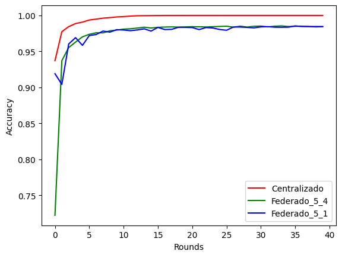

# Trabalho T2 – Implementação de Aprendizado Federado
## Integrantes: Bruno Menegaz, Gustavo Dutra, Leonardo Albergaria
---
## **Instruções para Compilação e Execução**

### **Inicializando Ambiente**

Para realizar a instalação, o primeiro passo é clonar o repositório para um diretório local e instalar o python em conjunto das bibliotecas utilizadas. Para realizar o download de todas as dependências, basta utilizando o seguinte comando:

```
$ pip3 install -r requirements.txt
```

Como cada cliente roda em um processo distinto, é necessário dividir previamente a base de dados. Para isso, ao executar o programa *getSplitData*, são criadas pastas com dados para cada cliente. Dessa forma, cada cliente utilizará uma parte dos dados da base Mnist para realizar o treinamento. O repositório contém os dados separados para 36clientes, então caso haja necessidade de usar uma quantidade diferente de clientes, deve ser executado o seguinte comando (10 clientes neste exemplo):

```
$ python3 getSplitData.py 10
```

Em sequência, é necessário realizar a inicialização do broker *MQTT* a partir do docker. Para isso deve-se executar a linha de comando linux:

```
$ sudo docker-compose up -d
```

### **Execução**

Para realizar a execução do projeto, basta iniciar os clientes (utilizando um novo terminal para cada cliente). É necessário passar como argumentos:
- Número de clientes a serem treinados por round
- Número mínimo de clientes
- Quantidade máxima de rounds
- Meta de acurácia
- ID do cliente

Vale destacar que devemos obedecer a estrutura de diretórios criados em /mnist_data, dessa forma o respectivo ID do cliente a ser passado deve se referir a uma pasta criada. Um exemplo de linha de comando do cliente de ID 0 que acessará os dados do diretório /mnist_data/client_0, ficará da seguinte forma:

```
$ python3 Client.py 4 5 5 1.0 0
```
---
## **Link para o vídeo no Youtube**

> https://youtu.be/kt6b1JltQL8

---
## **Implementação**

Para apresentarmos a nossa aplicação iremos passar por cada arquivo desenvolvido dando uma ideia geral das suas funcionalidades.

### **Client.py**

Define a classe Client, responsável pela escolha do cliente controlador e dos clientes de aprendizado. Cada client possui algumas variáveis importantes, como seu **ID** (um inteiro de [0, 65335]), uma lista de clientes conectados, a tabela de votos, o **ID** do controlador, etc.

Os métodos **_on_connect_** e **_on_message_** são chamados quando o cliente se conecta ao broker **MQTT** e quando recebe uma mensagem, respectivamente. Ao se conectar, um cliente se inscreve nos tópicos **"sd/init"** e **"sd/voting"**. Ao receber uma mensagem, caso seja do tópico **init**, o cliente atualiza a lista de clientes conectados, e caso o mínimo de clientes já estejam conectados, a votação é iniciada. Caso a mensagem recebida seja do tópico **voting**, o cliente atualiza sua tabela de votos com o voto recebido.

O método **vote** é usado para gerar um voto aleatório e publicá-lo no tópico **"sd/voting"**, onde o voto é um inteiro aleatório de [0, 65335]. Já o método **countVote** seleciona como vencedor da votação o cliente que enviou o número mais alto, atualizando o **self.controller_id** com o ID do cliente vencedor.

Por fim, os métodos **startController** e **startFedClient** instanciam o controlador e os clientes de aprendizado federado, respectivamente. 

Um cliente é inicializado a partir de **runClient**, onde se conecta ao broker, publica uma mensagem em **"sd/init"** e então espera o resultado da eleição. A partir desse resultado, acontecerá uma instanciação de um *Controller* ou um *FedClient*.

### **Controller.py**

O controlador é responsável por coordenar o treinamento federado. Ele inicia se conectando ao broker MQTT e se inscrevendo nos tópicos **sd/RoundMsg** e **sd/EvaluationMsg**. Para cada rodada de treinamento, o controlador seleciona aleatoriamente quais clientes irão participar do treinamento e então publica esse resultado no tópico *TrainingMsg*.

Ao receber uma mensagem do tópico *sd/RoundMsg*, o controlador realiza a agregação dos pesos locais dos modelos construídos pelos clientes. Os pesos globais são então publicados no tópico *AggregationMsg*.

Ao receber uma mensagem do tópico *sd/EvaluationMsg*, o controlador obtém as acurácias locais de cada cliente e faz uma média global. Por fim, se a meta de acurácia foi atingida, ele publica uma mensagem no tópico *FinishMsg* para encerrar o treinamento. Caso contrário, prepara uma nova rodada de treinamento, repetindo todo o processo.

### **FedClient.py**

O cliente de aprendizado federado inicia obtendo os dados de treinamento específicos para um determinado ID de cliente (cid). Esses dados são os que foram pré-estabelecidos pelo script *getSplitData.py* e representam um subconjunto dos dados de treinamento disponíveis.

Após carregar os dados de treinamento, o cliente chama a função runClient, conectando-se ao broker MQTT e se inscrevendo nos tópicos **sd/TrainingMsg**, **sd/AggregationMsg** e **sd/FinishMsg**.

Ao receber uma mensagem do tópico *TrainingMsg*, o cliente irá iniciar uma rodada de treinamento caso tenha sido escolhido para aquele round, e publicar no tópico **sd/RoundMsg** os pesos locais do modelo construído.

Ao receber uma mensagem do tópico *AggregationMsg*, o cliente atualiza os pesos do modelo local com os pesos e realiza uma avaliação, publicando no tópico **sd/EvaluationMsg** a acurácia obtida.

Por fim, uma mensagem do tópico *FinishMsg* significa que a meta de acurácia foi atingida, encerrando então o cliente.

## **Testes e Resultados**

Para analisar os resultados, a aplicação foi testada de três formas: Centralizado, Federado utilizando 5 clientes e 4 cliente por round, e Federado utilizando 5 clientes e 1 clientes por round.

> 

Analisando o gráfico, é possível perceber que as duas abordagens federadas tem resultados similares, com uma estabilidade superior no caso de 4 clientes por round.

Tal resultado não condiz com o esperado em uma aplicação real, uma vez que o ideal seria o teste com um cliente por round performar de forma inferior, porém podemos explicar esse fenômeno da seguinte forma: como a base de dados foi dividida de forma homogênea para os clientes, isso implica que não há uma disparidade significativa entre os datasets de cada cliente, dessa forma um modelo global que foi construído a partir dos pesos de um cliente específico irá performar relativamente bem em outros clientes, visto que os dados não possuem fortes particularidades.

## **Conclusão**

A partir dos testes realizados, concluímos que os resultados encontrados condizem com o que se esperava a partir do escopo do trabalho. Foi possível realizar os objetivos de implementar o aprendizado federado, utilizando como meio de comunicação um broker MQTT no padrão Publish/Subscribe com filas de mensagens, funcionando da forma esperada.